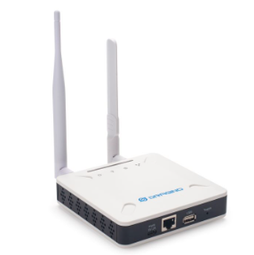
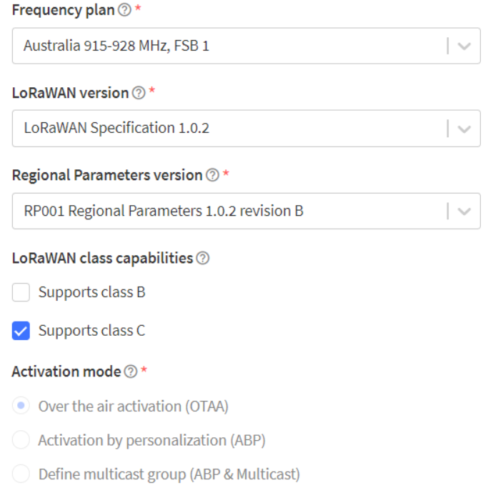
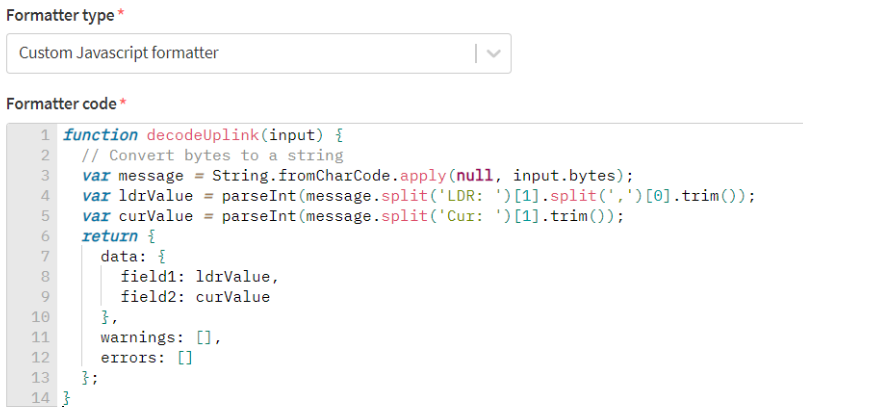
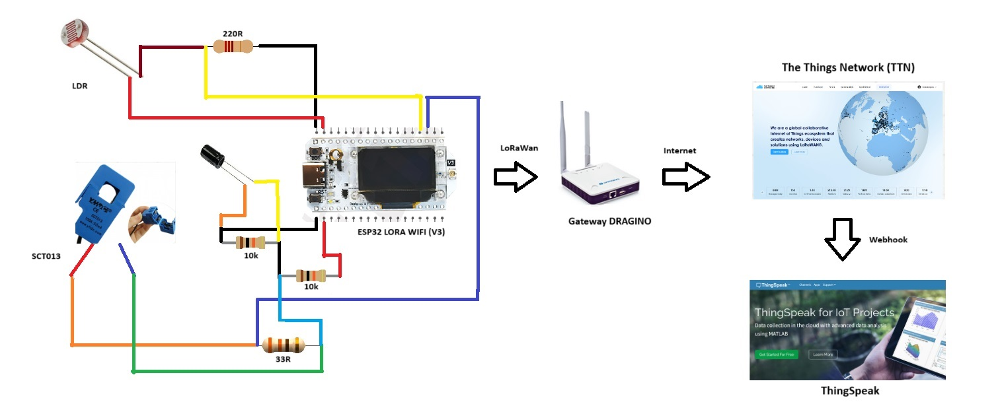

# Sistema de monitoramento com gateway LoRaWAN para o gerenciamento da iluminação em postes de iluminação pública

## Descrição do projeto
O projeto "Sistema de Monitoramento com Gateway LoRaWAN para o gerenciamento da iluminação em postes de iluminação pública" desenvolvido como parte de um trabalho para Projeto de Sistemas Ubiquos na UFSC, tem como objetivo empregar o gateway LoRaWAN como intermediário para coletar dados de sensores instalados nos postes e transmiti-los para uma nuvem IoT, visando otimizar o monitoramento e o controle da iluminação, promovendo eficiência energética e manutenção proativa.

## Autores do projeto
* Fabiola Augusta Dahlke Spredemann;
* Ramom da Silva

## Introdução

### Objetivos específicos
* Estabelecer uma comunicação eficiente entre os sensores de iluminação e o gateway LoRaWAN, garantindo a integridade e confiabilidade dos dados coletados;
* Busca-se configurar o gateway para enviar os dados de maneira segura e eficaz para a nuvem IoT, assegurando uma transmissão eficiente e uma gestão centralizada dos dados de iluminação pública.

Continue lendo para obter uma visão detalhada da implementação do projeto, que inclui instruções de montagem de hardware, configuração de software e operação do sistema.

## Hardware

### Sensor de corrente não invasivo (SCT-013)
<p>Os sensores de corrente são responsáveis por medir os níveis de corrente dos postes de iluminação até 15A.</p>
<div align="center">
    
</div>

### Sensor de luminosidade (LDR)
<p>Os sensores de luminosidade são responsáveis por medir os níveis de luminosidade dos postes de iluminação através da variação de sua resistência interna.</p>
<div align="center">
    
</div>

### Gateway Dragino
<p>Responsável por coletar dados enviados pelo Lora e transmiti-los para a nuvem IoT.</p>
<div align="center">
    
</div>

### Esp 32 Lora Wifi (V3)
<p>Responsável pela comunicação sem fio entre os sensores de corrente, luminosidade e o gateway através do recurso de rede LoRaWan.</p>


## Software

### Softwares Utilizados

#### Arduino IDE

#### The Things Network

#### ThinkSpeak


### Configurações

#### Dragino
<p>Utilizar a frequência da Austrália AU915 e faixa de frequências 1.</p>

#### Arduino IDE
- Utilizar como código de exemplo do fabriacante (HELTEC ESP 32 → LORAWAN → LORAWAN), lembrando de configurar a região nas opções como AU e trocar a classe para C.

    ```DeviceClass_t  loraWanClass = CLASS_C;```

- Para ler os dados das portas, deve-se usar OBRIGATORIAMENTE a numeração do GPIO (senão vai dar problema de leitura, e na pinagem tem repetição das portas).

- Para enviar os dados, que devem ser inteiros, salvar em um array de char, conforme código abaixo:
  ```
    char message[24];
    snprintf(message, sizeof(message), "LDR: %d, Cur: %d", ldrValue, pot);

    appDataSize = strlen(message); // Set appDataSize to the length of the message

    for (int i = 0; i < appDataSize; i++) {
        appData[i] = (uint8_t)message[i]; // Convert each character to its ASCII value
    }

#### TTN
<p>Criar dispositivo customizado usando **OBRIGATORIAMENTE** a **classe C** e faixa de frequências 1 (a comunicação falha se for diferente). Pode-se utilizar a TTN para gerar os ids necessários para o código (devEUI, appEUI e appkey), conforme mostra a imagem abaixo. </p>


Além disso, para os dados serem enviados corretamente para o ThinkSpeak, é preciso que haja uma decodificação da mensagem do ESP no TTN. Para isso, é preciso seguir os seguintes passos:
1. Ir no payload formatter e selecionar a opção "custom javascript"
2. Usar o código abaixo.


#### ThinkSpeak
Basta seguir a documentação oficial e utilizar o endpoint abaixo.

- [Documentação oficial](https://www.thethingsindustries.com/docs/integrations/cloud-integrations/thingspeak/)
- [Endpoint](https://api.thingspeak.com/things_network/v3/update)


## Esquema de Conexão


###


 
